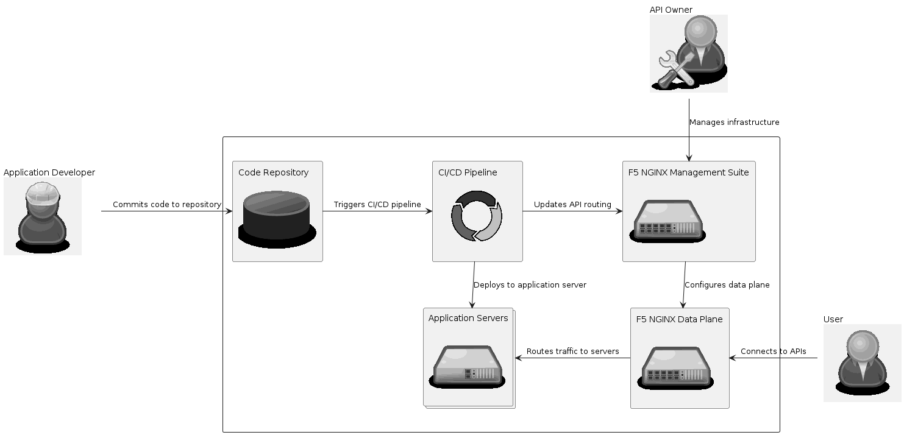

# Deploying API Changes to F5 NGINX API Connectivity Manager (ACM)

## Solution Description


In this solution a developer's changes to an API specified by an OpenAPI document are deployed to F5 NGINX API Connectivity Manager (ACM).
The changes are deployed using an Ansible playbook that leverages ACM's REST API.
Using this solution in a CI/CD pipeline provides a way to automate API discovery, registration, and security as API changes are made.

## Value
API changes are published to a central location as they are made to improve API discovery.
Specifically, this solution solves the following use case:
```gherkin
Given a running instance of F5 NGINX Management Suite
    And a workspace is configured with F5 NGINX Management Suite
When a developer commits an API change
Then the API documentation in the Dev Portal is updated
    And traffic policies are updated to securely route traffic to the new API
```

## Demo


## Automation to Deploy Solution
Automation is done using Ansible.
Running the `deploy.yml` playbook with the appropriate environment variables will deploy the OpenAPI document to F5 NGINX Management Suite.

### Environment Variables
* NMS_WORKSPACE: The service workspace that API changes should be published to.
* NMS_USER: Username of the Management Suite account that will be making the updates.
* NMS_PASSWORD: Password of the Management Suite account that will be making the updates.
* NMS_API_HOST: Hostname of NGINX Data Plane host.
* NMS_DEV_HOST: Hostname of the NGINX Developer Portal host.
* SVC_HOST: The hostname of the backend that is serving the API.

### CI/CD Example
Below is an example of running the playbook in a GitLab CI/CD job.
Most of the above environment variables are specified in the CI/CD variable settings.

```yaml
deploy-api:
  image: python:3.10
  stage: deploy
  script:
    - pip install ansible
    - chmod 400 $NMS_KEY
    - ANSIBLE_HOST_KEY_CHECKING=False ansible-playbook -u root -i "$NMS_HOST," --private-key $NMS_KEY deploy.yml
```

## Deep Dive
This section goes through the `deploy.yaml` Ansible Playbook in additional detail.
The playbook is making use of the `ansible.builtin.url` module to make calls to the F5 NGINX API Connectivity Manager REST API.

### Updating the API Document
```yaml
  - name: Check API Document
    ansible.builtin.uri:
      url: "{{ workspace }}/api-docs/{{ api_doc_name }}"
      user: "{{ lookup('ansible.builtin.env', 'NMS_USER') }}"
      password: "{{ lookup('ansible.builtin.env', 'NMS_PASSWORD') }}"
      method: get
      status_code: [200, 404]
    register: doc_result
```
First we need to check if the API document already exists.

```yaml
  - name: Create API Document
    when: doc_result.json._links | length == 0
    ansible.builtin.uri:
      url: "{{ workspace }}/api-docs"
      user: "{{ lookup('ansible.builtin.env', 'NMS_USER') }}"
      password: "{{ lookup('ansible.builtin.env', 'NMS_PASSWORD') }}"
      method: post
      body_format: json
      body: "{{ openapi_file | from_yaml | to_json }}"
      status_code: [201]
    changed_when: true
```
If the API document does not exist, we create it with a `POST` request.

```yaml
  - name: Update API Document
    when: doc_result.status == 200
    ansible.builtin.uri:
      url: "{{ workspace }}/api-docs/{{ api_doc_name }}"
      user: "{{ lookup('ansible.builtin.env', 'NMS_USER') }}"
      password: "{{ lookup('ansible.builtin.env', 'NMS_PASSWORD') }}"
      method: put
      body_format: json
      body: "{{ openapi_file | from_yaml | to_json }}"
      status_code: [200]
    changed_when: true
```
If the API document already exists, then we would get a 409 status code response with a `POST` request.
Instead we can use a `PUT` request to update the proxy configuration.

### Updating the Proxies
```yaml
  vars:
    proxy_name: petstore-api
    openapi_path: src/main/resources/openapi.yaml
    openapi_file: "{{ lookup('ansible.builtin.file', openapi_path) }}"
    api_title: "{{ (openapi_file | from_yaml).info.title | lower | regex_replace('\\s', '-') }}"
    api_version: "{{ (openapi_file| from_yaml).info.version | regex_replace('\\.', '-') }}"
    api_doc_name: "{{ api_title }}-{{ api_version }}"
    proxy_config:
      name: "{{ proxy_name }}"
      version: v1
      specRef: "{{ api_doc_name }}"
      proxyConfig:
        hostname: "{{ lookup('ansible.builtin.env', 'NMS_API_HOST') }}"
        ingress:
          basePath: "/api/v1"
        backends:
        - serviceName: "{{ proxy_name }}-svc"
          serviceTargets:
            - hostname: "{{ lookup('ansible.builtin.env', 'SVC_HOSTNAME') }}"
      portalConfig:
        hostname: "{{ lookup('ansible.builtin.env', 'NMS_DEV_HOST') }}"
```
At the beginning of the playbook we create the proxy configuration and store it in a variable.
This makes it easier for us to reuse this data for different HTTP requests without duplicating it in the playbook.
When the API document is uploaded, it is given a generated name.
Fortunately, that name is deterministic, so we can predict what it will be in order to provide it in the proxy configuration in the `specRef` property.

```yaml
  - name: Check Proxy
    ansible.builtin.uri:
      url: "{{ workspace }}/proxies/{{ proxy_name }}"
      user: "{{ lookup('ansible.builtin.env', 'NMS_USER') }}"
      password: "{{ lookup('ansible.builtin.env', 'NMS_PASSWORD') }}"
      method: get
    register: proxy_result
```
First we need to check if the proxy already exists.

```yaml
  - name: Create proxy
    when: proxy_result.json._links | length == 0
    ansible.builtin.uri:
      url: "{{ workspace }}/proxies"
      user: "{{ lookup('ansible.builtin.env', 'NMS_USER') }}"
      password: "{{ lookup('ansible.builtin.env', 'NMS_PASSWORD') }}"
      method: post
      body_format: json
      body: "{{ proxy_config | to_json }}"
      status_code: [202]
    changed_when: true
```
If the proxy configuration does not exist, we create it with a `POST` request.

```yaml
  - name: Update proxy
    when: proxy_result.json._links | length > 0
    ansible.builtin.uri:
      url: "{{ workspace }}/proxies/{{ proxy_name }}"
      user: "{{ lookup('ansible.builtin.env', 'NMS_USER') }}"
      password: "{{ lookup('ansible.builtin.env', 'NMS_PASSWORD') }}"
      method: put
      body_format: json
      body: "{{ proxy_config | to_json }}"
      status_code: [202]
    changed_when: true
```
If the proxy already exists, then we would get a 409 status code response with a `POST` request.
Instead we can use a `PUT` request to update the proxy configuration.
