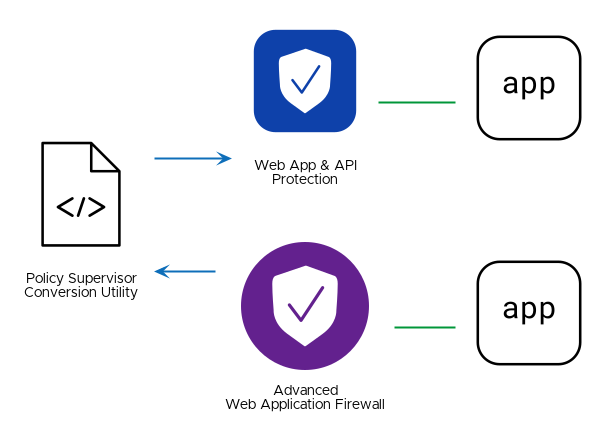

# Replicate an F5 BIG-IP Advanced Web Application Firewall (AWAF) in F5 Distributed Cloud Web Application and API Protection (WAAP)

## Solution Description
Customers find it challenging, complex, and time-consuming to define, deploy, and manage application security policies across their WAF deployments which span the F5 portfolio (including BIG-IP, NAP, and F5XC WAAP) within on-prem, cloud, and edge environments.
This solution offers both a manual and automated workflow for converting AWAF files into F5 Distributed Cloud Application Firewalls and Service Policy objects.
You can upload The converted results to a Distributed Cloud Namespace with the HTTP API.

## Value
By enforcing consistent WAAP security policies across multiple clouds and SaaS environments, organizations can establish a robust and standardized security posture, ensuring comprehensive protection, simplified management, and adherence to compliance requirements.

## Demo

## Steps to Deploy Solution
1. Upload AWAF file to `policysupervisor.io/convert` (you can use the `policy.awaf.json` sample policy from this repository)
2. Download and extract results
3. Copy the firewall JSON file to `Web App & API Protection -> Manager -> App Firewall -> Add App Firewall -> JSON` in Distributed Cloud Console and click `Save and Exit`
4. Copy the firewall JSON file to `Web App & API Protection -> Manager -> Service Policies -> Service Policies -> Add Service Policy -> JSON` in Distributed Cloud Console and click `Save and Exit`
5. You can now attach the Firewall and Service Policy to your HTTP Load Balancer in the Distributed Cloud Console

## Using Automation for a Policy-as-Code Solution
With APIs available for all the steps to deploy this solution, you can add these steps to a CI/CD pipeline as a script.
You can find an example of such a script in the `policy-supervisor-converter` directory.
This allows for a policy-as-code solution where you can commit a BIG-IP AWAF policy to your repository, run the script as part of your CI/CD pipeline, and have your policy replicated to all desired targets.
Updates to those policies will continue to be replicated to the target platforms by the same CI/CD pipeline.
