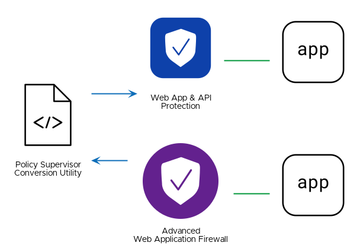

# Migrate from F5 BIG-IP Advanced Web Application Firewall (AWAF) to F5 Distributed Cloud Web Application and API Protection (WAAP)

## Solution Description
Customers find it challenging, complex, and time-consuming to define, deploy, and manage application security policies across their WAF deployments which span the F5 portfolio (including BIG-IP, NAP, and F5XC WAAP) within on-prem, cloud, and edge environments.
This solution offers both a manual and automated workflow for converting AWAF files into F5 Distributed Cloud Application Firewalls and Service Policy objects.
You can upload The converted results to a Distributed Cloud Namespace with the HTTP API.

## Value
By enforcing consistent WAAP security policies across multiple clouds and SaaS environments, organizations can establish a robust and standardized security posture, ensuring comprehensive protection, simplified management, and adherence to compliance requirements.

## Demo
Demo publication is in progress, please check back later.
<!---->

## Steps to Deploy Solution
1. Upload AWAF file to `policysupervisor.io/convert` (you can use the `policy.awaf.json` sample policy from this repository)
2. Download and extract results
3. Send POST request to `https://{tenant}.ves.volterra.io/api/config/namespaces/{namespaceName}/app_firewalls` using the firewall result from the converter
4. Send POST request to `https://{tenant}.console.ves.volterra.io/api/config/namespaces/{namespaceName}/service_policys` using the service policy result from the converter
5. You can now attach the Firewall and Service Policy to your HTTP Load Balancer

## Automating the solution
With APIs available for all the steps to deploy this solution, you can add these steps to a CI/CD pipeline as a script.
You can find an example of such a script in the `policy-supervisor-converter` directory.
