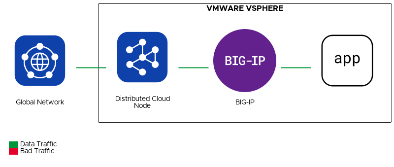

# Connect F5 BIG-IP to F5 Distributed Cloud

## Solution Description
In this solution we deploy a Distributed Cloud Node in our data center to add the BIG-IP and its applications as a site in Distributed Cloud.
With that done, we can direct traffic to the BIG-IP by configuring it as an origin server.
This gives customers access to Distributed Cloud's feature set in an additive manner that does not require changing their existing configuration.



## Value
```gherkin
Given an existing BIG-IP deployment
When an F5 Distributed Cloud Node is added
Then traffic can flow from the F5 Distributed Cloud Global Network to the BIG-IP
```

## Demo
Demo publication is in progress, please check back later.
<!--[](https://www.youtube.com/watch?v=2fRqVYpZOK4&t=519s)-->

## Automation to Deploy Solution
This solution uses the [Volterra](https://registry.terraform.io/providers/volterraedge/volterra/latest/docs) and [VMware vSphere](https://registry.terraform.io/providers/hashicorp/vsphere/latest/docs) Terraform providers.
Please refer to the provider documentation for configuring prerequisites.

1. Create a Site Token if one does not already exist
2. Deploy using Terraform

## Deep Dive
### Namespace
```hcl
resource "volterra_namespace" "namespace" {
  name = var.volterra_namespace_name
}
```
We start off by creating a namespace to keep our configuration objects organized.
All we need to configure here is the name for the namespace.
Most resources in F5 Distributed Cloud require a namespace.
Some resources must be created in the `system` namespace.

### Site Token
```hcl
resource "volterra_token" "token" {
  name      = "this-does-not-matter"
  namespace = "system"
}
```
This resource behaves more like a data source than a resource, and will not create or manage any corresponding Distributed Cloud object.
Instead, it allows you to read the value of an existing Site Token.
If you do not already have a site token, you will need to create one through the Distributed Cloud Console before running Terraform.
It will always have the data of the first Site Token in the tenant, regardless of the name specified in the resource.
Initially this might seem like a problem if you cannot get the token specific to your site, but the token used does not actually matter.
In fact, you can delete the token later with no impact to the site connectivity.

### App Stack Site
```hcl
resource "volterra_voltstack_site" "volterra_site" {
  name      = var.volterra_site_name
  namespace = "system"

  volterra_certified_hw = var.volterra_certified_hardware
  master_nodes = [
    var.volterra_master_hostname
  ]
}
```
This resource will create an App Stack Site that represents our data center.
The `volterra_certified_hw` and `master_nodes` properties must be consistent with the Distributed Cloud Node settings.

### Registration
```hcl
resource "time_sleep" "registration_wait" {
  depends_on = [
    vsphere_virtual_machine.f5xc_node
  ]

  triggers = {
    vm_id = vsphere_virtual_machine.f5xc_node.id
  }

  create_duration = "600s"
}
resource "volterra_registration_approval" "approval" {
  depends_on = [
    volterra_voltstack_site.volterra_site,
    time_sleep.registration_wait
  ]

  cluster_name = var.volterra_site_name
  cluster_size = 1
  hostname     = var.volterra_master_hostname
}
```
On startup, the Distributed Cloud Node will send a registration request to Distributed Cloud.
We use this Terraform resource to approve that registration request.
Unfortunately, we do not know when the node submits the registration request.
To get around this, we can force a delay in the Terraform execution using the `time_sleep` resource.
You can try adjusting the `create_duration` property to better match the times you see in your deployment.

### Origin Pool
```hcl
resource "volterra_origin_pool" "pool" {
  depends_on = [
    volterra_namespace.namespace,
    volterra_registration_approval.approval
  ]

  name                   = format("%s-pool", var.volterra_site_name)
  namespace              = var.volterra_namespace_name
  loadbalancer_algorithm = "LB_OVERRIDE"
  endpoint_selection     = "LOCAL_PREFERRED"

  origin_servers {
    private_ip {
      ip = "192.0.2.1"
      site_locator {
        site {
          name = var.volterra_site_name
        }
      }
      outside_network = true
    }
  }

  port = 80
}
```
Here where we tell F5 Distributed Cloud how to send traffic to our BIG-IP, and it will require some changes based on your deployment.
Most importantly, you will need to provide an appropriate IP address, or use a DNS name to identify the BIG-IP.

### Node Virtual Machine
Most of the Terraform code for the virtual machine comes from the examples in the vSphere provider documentation.
Let's focus on the details specific to deploying a Distributed Cloud Node.

```hcl
  ovf_deploy {
    remote_ovf_url    = "https://downloads.volterra.io/releases/images/2022-09-15/centos-7.2009.27-202209150812.ova"
    disk_provisioning = "thick"
    ovf_network_map = {
      "OUTSIDE" = data.vsphere_network.outside.id
      "REGULAR" = data.vsphere_network.inside.id
    }
  }
```

We can pull the OVA file directly from the official source using the `remote_ovf_url` property.
You can find all available Distributed Cloud Node images [here](https://docs.cloud.f5.com/docs/images).
If you would rather upload the OVA file from a local source, you can use the `local_ovf_path` property.
For more information on these options, check out the documentation on [Deploying Virtual Machines from OVF/OVA](https://registry.terraform.io/providers/hashicorp/vsphere/latest/docs/resources/virtual_machine#deploying-virtual-machines-from-ovfova).
You can use the same network for the outside and inside (regular) interfaces if that better suites your deployment.

```hcl
  vapp {
    properties = {
      "guestinfo.ves.certifiedhardware" = "vmware-voltstack-combo"
      "guestinfo.ves.clustername"       = var.volterra_site_name
      "guestinfo.ves.latitude"          = "47.606209"   # Seattle
      "guestinfo.ves.longitude"         = "-122.332069" # Seattle
      "guestinfo.ves.token"             = volterra_token.token.id
    }
  }
```

Now we get to the most important part of virtual machine configuration: the vApp properties.
These settings allow you to customize the Distributed Cloud Node.
For this example, we will configure the essential properties and ignore the rest.
The `guestinfo.ves.certifiedhardware` setting must be consistent with the OVF used, and must be consistent throughout the entire configuration.
A typo in the certified hardware field anywhere will cause setup to fail.

## Troubleshooting
You can log in to the Distributed Cloud node via SSH using the `admin` user and the password specified in the `volterra_node_password` variable.
The default password for the `admin` user is `Volterra123`.
This will log you in to the SiteCLI tool.
You can use `log vpm` to see the logs and check for errors.
