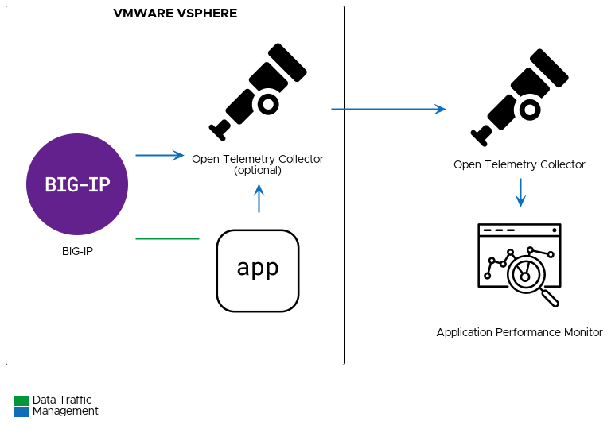
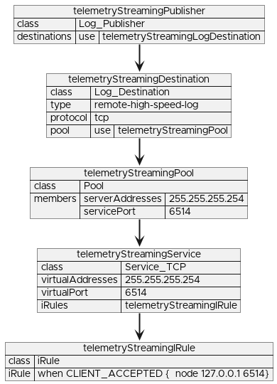

# Monitoring Traditional Applications on F5 BIG-IP

## Solution Description
Customers may find it cumbersome, time-consuming, and costly to proactively ensure that their mission-critical workloads are operating in an optimized manner.
This proves challenging to ensure a consistently high-quality user experience (UX) to ensure customer stickiness and repeatable business.
In order to address these challenges, this solution demonstrates how to configure F5 BIG-IP using the Telemetry Streaming and Application Services extensions to send traffic metrics to an Open Telemetry Collector.
For the demo, we have our [Open Telemetry Collector](https://github.com/open-telemetry/opentelemetry-collector-contrib) configured to forward data to a [Grafana LGTM](https://grafana.com/) stack, but any monitoring solution compatible with Open Telemetry should work.



## Value
Specifically, this solution solves the following use case:
```gherkin
Given a running instance of F5 BIG-IP
    And an application is load balanced by that instance of F5 BIG-IP
    And a third party monitoring solution
When the application's traffic patterns change
Then the changes can be visualized in the third party monitoring solution
```

## Demo
Demo publication is in progress, please check back later.
<!--[](https://www.youtube.com/watch?v=2fRqVYpZOK4&t=519s)-->

## Automation to Deploy Solution
1. Install [Telemetry Streaming extension](https://github.com/F5Networks/f5-telemetry-streaming).
2. Install [Application Services extension](https://github.com/F5Networks/f5-appsvcs-extension).
3. Modify `open-telemetry.ts.json` with information on how to connect to your Open Telemetry Collector.
4. Send a POST request to the `mgmt/shared/telemetry/declare` endpoint with `open-telemetry.ts.json` as the payload.
5. Send a POST request to the `mgmt/shared/appsvcs/declare` endpoint with `common.as3.json` as the payload.
6. Modify  `demo.as3.json` to match the needs of your application.
7. Send a POST request to the `mgmt/shared/appsvcs/declare` endpoint with `demo.as3.json` as the payload.

## Deep Dive
### Telemetry Streaming Configuration
There are three components we need to configure in Telemetry Streaming to get the data we want to an Open Telemetry Collector.
In the following sections we will explore how to configure each of these components.
The full Telemetry Streaming declaration is available as [open-telemetry.ts.json](open-telemetry.ts.json).

#### System Poller
```json
{
  "class": "Telemetry_System_Poller",
  "interval": 10,
  "endpointList": [
    {
      "protocol": "http",
      "path": "mgmt/tm/ltm/profile/http/stats?$select=resp_2xxCnt,resp_4xxCnt,resp_5xxCnt,tmName",
      "name": "responseCodes"
    }
  ]
}
```
Here we have a `Telemetry_System_Poller` class configured with custom endpoints to gather response status codes.
Custom endpoints are being used here to only gather the data we are interested in.
This allows Telemetry Streaming to do less work and have significantly less impact on the BIG-IP system.
Because we are gathering a lot less data than the default System Poller, we can use a more aggressive query interval of 10 seconds.
Custom endpoints can be used to gather any data that is available through the [iControlREST](https://clouddocs.f5.com/api/icontrol-rest/) API.
If you would rather use SNMP, Telemetry Streaming can now [query SNMP endpoints](https://clouddocs.f5.com/products/extensions/f5-telemetry-streaming/latest/declarations.html#querying-snmp-using-a-custom-endpoint).
Additional information on the endpoints that Telemetry Streaming gathers by default can be found [here](https://clouddocs.f5.com/products/extensions/f5-telemetry-streaming/latest/poller-default-output-reference.html).

#### Listener
```json
{
  "class": "Telemetry_Listener",
  "port": 6514
}
```
The `Telemetry_Listener` class is very simple to configure in Telemetry Streaming.
However, we will see that we will need to do some additional configuration to setup the BIG-IP to actually send data to this listener.
For now, we are just telling Telemetry Streaming to listen for data coming in on port 6514.

#### Consumer
```json
{
  "class": "Telemetry_Consumer",
  "type": "OpenTelemetry_Exporter",
  "host": "monitor.example.com",
  "metricsPath": "/v1/metrics",
  "port": 80,
  "protocol": "http",
  "exporter": "json"
}
```
Now that we have configured Telemetry Streaming to gather data, we need to configure a `Telemetry_Consumer` class to send that data to our third party monitoring tool.
For this example, we are sending data to an Open Telemetry Collector over HTTP.
A list of available Telemetry Streaming consumers can be found [here](https://clouddocs.f5.com/products/extensions/f5-telemetry-streaming/latest/).
Furthermore, the Open Telemetry Collector can be configured to output to [many different formats](https://github.com/open-telemetry/opentelemetry-collector-contrib/tree/main/exporter).

### Application Services Common Configuration
Before we can configure per-application telemetry, we need to setup some shared components.
These shared components will be used to send data to Telemetry Streaming's Event Listener.
For this, we will be using the Application Services extension, commonly referred to as AS3.
The full AS3 declaration is available as [common.as3.json](common.as3.json).

#### Configuring Telemetry Streaming Log Publisher
First, let us look at configuring a BIG-IP Log Publisher component to forward data to Telemetry Streaming's Event Listener.
Unfortunately, we need a few intermediate components to make this happen.
These intermediate components are setup in a chain passing the data from one component to the next until it ultimately ends up reaching Telemetry Streaming.
Now it is time for some good news.
AS3 can configure all of these components for us.
Below is a diagram to visualize this chain of components and the AS3 configuration for each component.



A very important thing to note here is that we have deviated slightly from the configuration presented in the Telemetry Streaming documentation.
In order to send data from an iRule, **we need a Log Destination with no formatting**.
The Telemetry Streaming documentation uses a Splunk formatted Log Destination to get incoming data into a consistent format.

#### Sending Data to Telemetry Streaming via iRule
No BIG-IP article would be complete without an iRule.
Here we are using one to gather HTTP response times and sending them via high speed logging (HSL) to the Log Publisher we set up previously.
The most important part here is the formatting of the data.
As an advanced use case, Telemetry Streaming expects this custom data to be in a very particular format.
* Key value pairs are presented as a comma separated list
* Key names must have no quotation marks
* Values must have quotation marks
* It is best to avoid any spaces in this string

Below is the full iRule being used for this example.
It is base64 encoded in the AS3 declaration to make it easier to embed in the JSON payload.
Following this pattern, you can create iRules that can gather a wide variety of traffic data.

```tcl
when RULE_INIT {
    set ::min_log_interval 10
    set ::table_name app_data
    set ::publisher "/Common/Shared/telemetry_publisher"

    set ::lastlog 0
}
when HTTP_REQUEST {
    set t1 [clock clicks -milliseconds];
}
when HTTP_RESPONSE {
    set t2 [clock clicks -milliseconds];
    set duration [expr {$t2 - $t1}];
    table append -subtable $::table_name [virtual] " $duration";
    set now [clock seconds]

    # Only send data on a defined interval
    if {[expr { ($now - $::lastlog) > $::min_log_interval }]}{

        # Open a connection to a Publisher
        set hsl [HSL::open -publisher $::publisher]

        # Iterate through each application
        foreach key [table keys -subtable $::table_name] {
            set values [table lookup -subtable $::table_name $key]

            # Gather response time metrics
            set max 0
            set min 999999
            set total 0.0
            set count 0
            foreach value $values {
                if {[expr $value > $max]}{
                    set max $value
                }
                if {[expr $value < $min]}{
                    set min $value
                }
                set total [expr $total + $value]
                incr count 1
            }
            set avg [expr $total / $count]

            # Prepare data in JSON format
            set data application=\"[virtual]\",responseTimeMin=\"$min\",responseTimeMax=\"$max\",responseTimeAvg=\"$avg\"

            # Send data to a Publisher
            set send_result [HSL::send ${hsl} "${data}"]
            if {[expr $send_result == 0]} {
                log local0. "Failed to send data to $publisher, please ensure that it is not using a formatted destination."
            }
        }
        set ::lastlog $now
        table delete -subtable $::table_name -all
    }
}
```

### AS3 Per-Application Configuration
The AS3 declaration used for the application is slightly modified version of the [basic HTTP example](https://clouddocs.f5.com/products/extensions/f5-appsvcs-extension/latest/declarations/getting-started.html#simple-http-application).
There are two main differences.
First, we are attaching the iRule from the Common declaration to capture traffic data.
Second, we have a custom HTTP Profile.
Using a unique HTTP Profile for each application allows us to identify the HTTP Profile stats as belonging to this application.
Below is the full AS3 declaration.
It is also available as `demo.as3.json`.

```json:demo.as3.json
{
  "class": "ADC",
  "schemaVersion": "3.0.0",
  "AATT": {
    "class": "Tenant",
    "astroshop.example.com": {
      "class": "Application",
      "astroshop.example.com": {
        "class": "Service_HTTP",
        "virtualAddresses": [
          "10.192.125.162"
        ],
        "profileHTTP": { "use": "httpProfile" },
        "pool": "pool",
        "iRules": [
          { "use": "/Common/Shared/appTelemetryIRule" }
        ]
      },
      "httpProfile": {
        "class": "HTTP_Profile"
      },
      "pool": {
        "class": "Pool",
        "monitors": [
          "icmp",
          "http"
        ],
        "members": [
          {
            "servicePort": 80,
            "serverAddresses": [
              "10.192.125.164"
            ]
          }
        ]
      }
    }
  }
}
```
