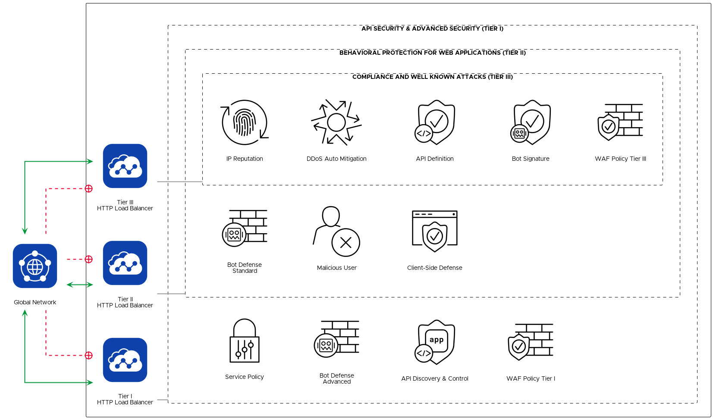

# Tiered WAAP in F5 Distributed Cloud

## Solution Description
This solution is about crafting the right level of security for a given application.
Low risk applications can use essential security features that require no tuning and little to no configuration.
Your high risk applications can use fine-tuned advanced security features.
If you require more granularity between these two tiers, you can add more tiers as needed.
This solution requires the use of host based routing since you will add applications to each tier by host.



## Value
With this solution in place, applications can be quickly deployed to and migrated between security tiers as needed.
```gherkin
Given applications accessed with host based routing
When the application host is added to a security tier
Then the application will be protected by appropriate security features
```

## Demo
[](https://www.youtube.com/watch?v=KUHv82L5cfo&t=824s)

## Automation to Deploy Solution
This solution uses the [Volterra](https://registry.terraform.io/providers/volterraedge/volterra/latest/docs) provider.
Please refer to the provider documentation for configuring prerequisites.

1. Customize security settings to your needs
2. Deploy using Terraform

## Deep Dive
The key resource of this solution is F5 Distributed Cloud HTTP Load Balancer objects.
You add an application to a tier by adding it to an appropriate load balancer's domain list.
If you have fewer than 32 applications per tier, then you will have one load balancer per tier.
However, Distributed Cloud has a limit of 32 domains per load balancer.
To work around this limit, you can create identical load balancers for every set of 32 domains you have.
Terraform can automatically spread domains across identical load balancers for us with the count property and some math.

```hcl
  count = ceil(length(var.tier3_domains) / 32)
  name = format("tier3-%d", count.index)
  namespace = var.volterra_namespace_name
  domains = slice(var.tier3_domains, count.index * 32, min((count.index + 1) * 32, length(var.tier3_domains)))
```

The security features and settings in each tier are highly dependent on your needs.
With a couple of changes, an HTTP Load Balancer and App Firewall with default settings will provide a good initial security tier.
For more information on the available properties and values, please refer to the [Volterra Provider documentation](https://registry.terraform.io/providers/volterraedge/volterra/latest/docs).
One strategy for building out these security objects is to create a sample object in the Distributed Cloud Console, and then view the object's JSON definition.
The JSON definition uses similar names and values as the Terraform provider.
